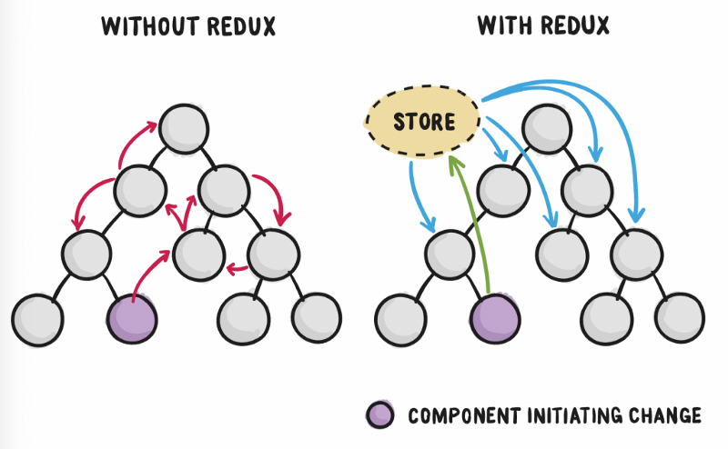
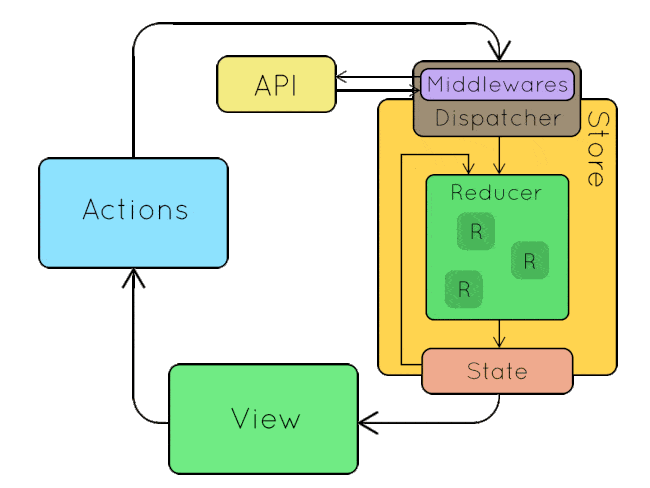
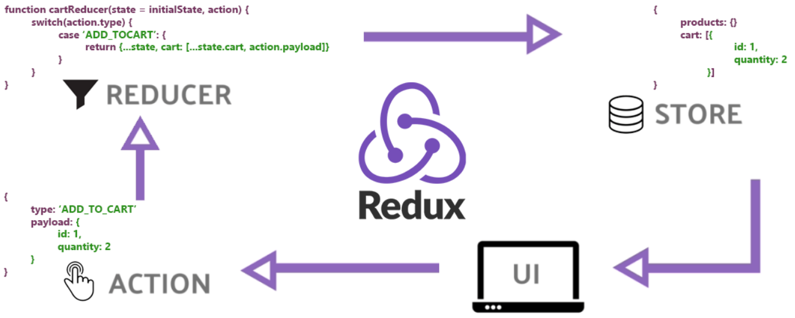

# Redux là gì?

Redux vs Without Redux:

Redux là một thư viện mã nguồn mở trong lĩnh vực phát triển web, được sử dụng để quản lý trạng thái (state) của ứng dụng. Redux thường được sử dụng cùng với React, nhưng nó cũng có thể tích hợp với bất kỳ framework hoặc thư viện JavaScript nào khác.

Các khái niệm quan trọng trong Redux bao gồm:

1. **Store:** Store là một đối tượng JavaScript chứa trạng thái của ứng dụng. Nó là nguồn duy nhất của sự thật và có thể được truy cập bởi toàn bộ ứng dụng.

2. **Actions:** Actions là các đối tượng JavaScript đơn giản mô tả các sự kiện hoặc thay đổi trong ứng dụng. Chúng có một thuộc tính `type` xác định loại action và dữ liệu payload bổ sung.

3. **Reducers:** Reducers là các hàm chỉ định cách trạng thái của ứng dụng thay đổi dựa trên các actions. Chúng nhận vào trạng thái hiện tại và một action làm đối số và trả về một trạng thái mới.

4. **Dispatch:** Dispatch là một hàm do Redux store cung cấp, được sử dụng để gửi các action. Khi một action được gửi đi, nó kích hoạt reducer tương ứng để cập nhật trạng thái.

5. **Middleware:** Middleware cung cấp một cách để mở rộng hành vi của Redux. Nó có thể được sử dụng cho việc ghi log, xử lý các action không đồng bộ, và nhiều công việc khác. Middleware đặt giữa việc gửi action và thời điểm nó đến reducer.

Luồng dữ liệu thông thường trong một ứng dụng Redux là:

1. **Giao diện (View):** Người dùng tương tác với ứng dụng, kích thích các action.
2. **Action:** Các action được gửi đến Redux store.
3. **Reducer:** Reducer xử lý các action và cập nhật trạng thái trong store.
4. **Trạng thái được cập nhật:** Trạng thái mới sau đó được phản ánh trong giao diện người dùng.

Sample:

Redux nổi tiếng vì tính đơn giản và khả năng quản lý logic trạng thái phức tạp một cách dự đoán. Thông thường nó được sử dụng trong các ứng dụng lớn nơi quản lý trạng thái trở nên phức tạp. Mặc dù Redux có thể thêm một số mã nền vào mã của bạn, nhưng nó giúp duy trì một luồng dữ liệu rõ ràng và dự đoán trong toàn bộ ứng dụng của bạn.